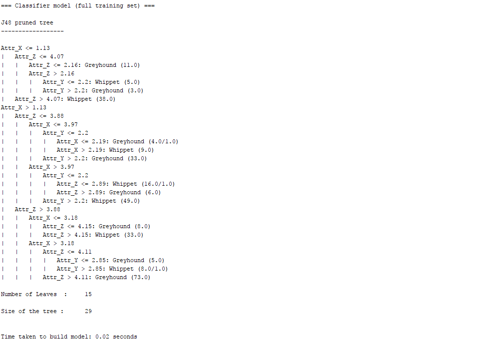
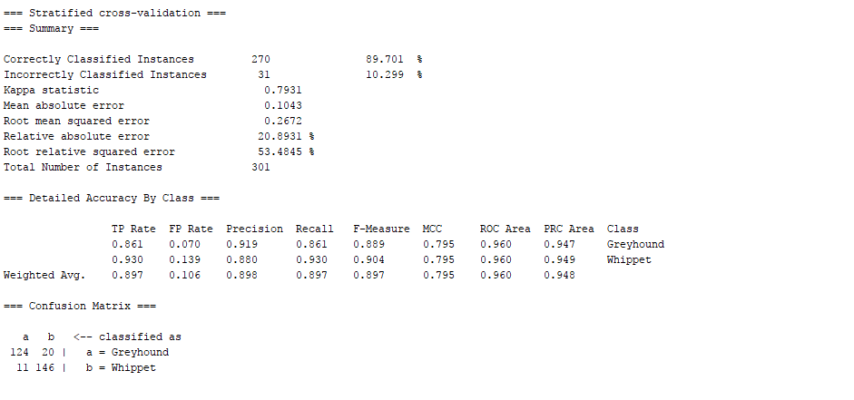

# Decison Tree Classification 
Its a program that writes a program.

## Learning
In this process, we learn the actual working of decision tree. How to find the best attribute (root node) for splitting data, also how the splitting of data stops into leaf nodes. Also, calculation of different measures of Impurity and finding bestness to find the best value and attribute to split it further. It is similar to working library in python up-to some extent, ie which gives us the code for classifier (decision tree).

## Process:
DecisionTree_Trainer.py file generates DecisionTree_Classifier.py (classifier file) as output. When executed the classifier file, it firstly calculates the accuracy (Accuracy = 90 %) for the training data and then it considers the Testing data. Lastly. It writes csv file DecisionTree_Classifier_Full_data.csv – Testing data with the class classified by the classifier.

When the results where compared with the J48 (Decision Tree) algorithm in WEKA it were almost the same. Below given is output from the WEKA:

